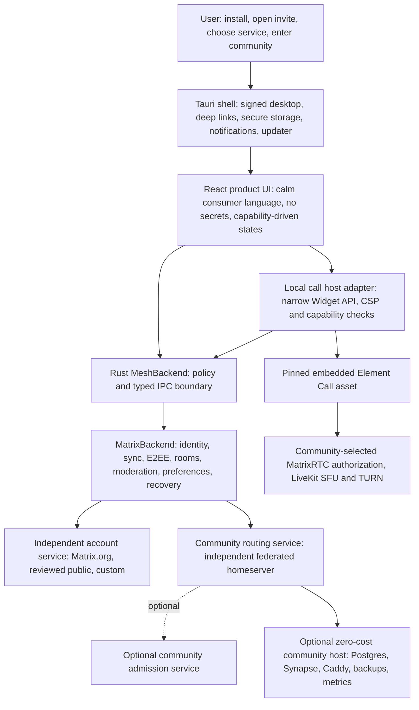

# Mesh reference-repository production implementation plan

**Prepared for:** the next ChatGPT Sol implementation agent
**Snapshot date:** 2026-07-31
**Repository:** `D:\Creations\Applications\mesh`
**Branch:** `main` (ahead of `origin/main` by two commits when audited)
**Purpose:** convert the strongest production patterns from Cinny, Folds, BetterDiscord, Element, Synapse, Element Call, and Compound into an executable Mesh program without weakening Mesh's consumer UX, zero-cost architecture, Matrix interoperability, or security boundaries.

This document augments `PRODUCTION_BETA_PLAN.md`; it does not replace it. When the two disagree, use this authority order:

1. `AGENTS.md` and the Mesh Product North Star;
2. current repository behavior and executable evidence;
3. `PRODUCTION_BETA_PLAN.md` for accepted production gates;
4. this document for the reference-derived sequencing and implementation details;
5. older agent plans and completion notes as historical evidence only.

Do not stage, commit, push, publish, deploy, reset, restore deleted files, or discard unrelated work unless the user explicitly authorizes it. Completed Mesh work belongs on `main`; do not leave a handoff on a long-lived feature branch.

---

## 1. Executive decision

Mesh should stop treating “production” as one all-or-nothing release and use two honest product milestones:

### Milestone A — production text/community beta

Ship a signed Matrix-only Windows beta when account-service choice, invitation onboarding, password/token login, recovery, encrypted messaging, moderation, diagnostics, accessibility, release provenance, and optional community-host operations pass their gates. Voice remains visibly unavailable with a plain explanation; it must not be advertised as production-ready.

This milestone is the fastest path to a real consumer product because most of its application surface already exists and has substantial local coverage. It does **not** require Mesh-operated paid infrastructure.

### Milestone B — production voice beta

Add voice only after a narrow architecture spike decides whether Mesh can safely embed the pinned `@element-hq/element-call-embedded` asset behind a least-privilege Matrix Widget API adapter. The replacement must preserve Rust-owned account/session authority, local CSP isolation, MatrixRTC membership-bound media encryption, cross-homeserver federation, TURN fallback, reconnect behavior, and explicit privacy consent.

If that spike cannot meet those constraints, keep voice off. Do not reactivate the current custom MatrixRTC join path just to claim feature completeness.

### The central production strategy

- Keep the current Rust-owned Matrix control plane for identity, rooms, membership, moderation, encryption state, preferences, and synchronization.
- Learn from Cinny's calm onboarding and explicit service configuration, but keep Mesh's stronger account-service disclosure and invite/account separation.
- Use Folds and Compound as design-contract references, not as a reason to rebuild the UI again.
- Use Element Web/Desktop as the test, support-policy, updater, and release-engineering benchmark.
- Use Synapse as the operator security, backup, federation, abuse-control, and monitoring benchmark.
- Prefer the upstream embedded Element Call asset over maintaining a second hand-built calling client, but only after the decision gate proves the security and licensing model.
- Borrow BetterDiscord's safe-mode, release-channel, recovery, and changelog ideas. Explicitly reject arbitrary JavaScript/CSS plugin injection in the production app.
- Introduce localization now, before more user-facing strings make it expensive.
- Make every release claim traceable to a machine-readable readiness ledger and same-commit evidence.

---

## 2. Audit scope and method

The nine upstream repositories were cloned as shallow, blob-filtered local audit copies. The audit covered current source trees, package/build configuration, workflows, release metadata, test organization, security and operator documentation, desktop packaging, onboarding/recovery surfaces, design-system contracts, calling architecture, and licensing boundaries.

The referenced screenshots were not present in the task payload available to this audit. Do not invent visual conclusions from missing images. If screenshots are supplied later, add them to the visual acceptance pack described in WP-10 without changing security or architecture decisions solely to match an image.

### Upstream snapshots

| Repository | Audited commit | Date | License signal | Primary production lesson |
|---|---:|---:|---|---|
| `cinnyapp/cinny-desktop` | `0f08c3a5b611` | 2026-07-31 | AGPL-3.0 | Tauri desktop packaging, signed multi-platform artifacts, explicit manual-update fallback |
| `cinnyapp/cinny` | `730a748aca42` | 2026-07-27 | AGPL-3.0 | Calm Matrix UX, configurable service selection, recovery UX, embedded Element Call direction |
| `cinnyapp/folds` | `15a941ffc255` | 2026-07-27 | Apache-2.0 | Small semantic token contract, intent states, focus and component primitives |
| `BetterDiscord/BetterDiscord` | `aa241f9fd57f` | 2026-07-22 | Apache-2.0 | Safe mode, canary channels, changelog/update UX; unsafe plugin injection is a negative reference |
| `element-hq/element-web` | `7ffb0ffced8b` | 2026-07-31 | AGPL/GPL/commercial | Release-scale E2E taxonomy, supported-environment policy, OIDC/recovery/call coverage, unified web/desktop repository |
| `element-hq/element-desktop` | `264c591b9cbe` | 2026-03-25 | AGPL/GPL/commercial | Historical desktop shell/updater lessons; active desktop code has moved into `element-web/apps/desktop` |
| `element-hq/synapse` | `f61950d54d81` | 2026-07-31 | AGPL/commercial | Security patch cadence, content-origin separation, backup/restore, metrics, abuse callbacks, Complement federation tests |
| `element-hq/element-call` | `bfb5fb922f13` | 2026-07-30 | AGPL/commercial | Messenger-oriented embedded build, Matrix Widget API boundary, MatrixRTC/LiveKit/E2EE and federated call tests |
| `element-hq/compound` | `abccf71ace7d` | 2026-07-27 | AGPL/commercial | Three-tier design tokens, accessible primitives, documentation and component governance |

### Licensing rule

“Take inspiration” is not permission to paste code without provenance. Mesh is AGPL-3.0-only, but compatible licensing still requires attribution, source availability, notices, and preservation of upstream terms. Before copying non-trivial code or bundling an upstream artifact:

1. record repository, commit/tag, source path, license, and local destination in `mesh/docs/THIRD_PARTY_PROVENANCE.md`;
2. retain required copyright/license notices;
3. add the dependency/artifact to SBOM and release scanning;
4. prefer public APIs, behavior-level reimplementation, or pinned packages over copied internals;
5. stop for legal review if commercial/AGPL dual-license obligations are unclear.

---

## 3. Current Mesh truth at this snapshot

Mesh is substantially beyond a prototype. It already has a Tauri/React consumer shell, a Rust-owned Matrix backend, explicit public/custom service choice, deep links, Matrix invitations, encrypted messaging and recovery work, device/session surfaces, moderation, signed-release scaffolding, SBOM/provenance generation, public-site checks, an optional homeserver stack, a MatrixRTC stack template, accessibility automation, design tokens, command navigation, and extensive unit/E2E/Rust coverage.

It is not currently releaseable from the dirty worktree.

### Fresh local evidence collected on 2026-07-31

| Gate | Result | Interpretation |
|---|---|---|
| `git diff --check` | PASS | No whitespace-error blocker in the current diff |
| `npm run lint` | PASS | Current TypeScript/React lint passes |
| `npm audit --audit-level=high` | PASS, zero reported vulnerabilities | JavaScript dependency audit is locally clean at this snapshot |
| `npm run check:public-services` | PASS | Three reviewed account services passed current discovery checks; review dates expire and must remain scheduled evidence |
| `npm run check:public-site` | PASS | Nine pages, local links, invitation safety, and social asset passed |
| `npm run matrixrtc:preflight` | PASS configuration only | Compose, routes, runbook, evidence schema, and well-known example are structurally valid; no live voice evidence was collected |
| `npm run release:preflight` | PASS source mode only | Matrix-only, signed-Windows, draft-prerelease policy is present; this invocation does not supply a release version |
| `npm test -- --maxWorkers=1` | **FAIL** | 696 passed, 2 failed. Two settings expectations omit the newly returned `conversationPrivacy: {}` field |
| `npm run build` | **FAIL** | TypeScript reports three fixtures missing the required `PrivacyPreferences.conversationPrivacy` field |
| `npm run check:bundle-size` | NOT RUN | Build failed first |
| Rust tests / live federation | NOT RERUN | Do not treat prior handoff results as same-snapshot evidence |

### Exact current local failures

- `mesh/src/store/settings.test.ts`: two deep-equality expectations still use the old privacy object shape.
- `mesh/src/components/settings/UserSettingsPanel.test.tsx`: a `PrivacyPreferences` fixture is missing `conversationPrivacy`.
- `mesh/src/lib/account-transition.test.ts`: a `PrivacyPreferences` fixture is missing `conversationPrivacy`.
- `mesh/src/store/settings.sync.test.ts`: a `PrivacyPreferences` fixture is missing `conversationPrivacy`.

These appear to be fixture/expectation drift after introducing per-conversation privacy, not evidence that the feature itself is wrong. The next agent must verify the intended persistence and account-isolation semantics before updating expectations.

### Confirmed production boundaries

- Application/package/Tauri/Cargo version remains `0.1.0`. The generic source preflight passes, but the release workflow's explicit `-ReleaseVersion` path rejects `0.1.0` as a placeholder.
- Windows MSI/NSIS are the only active production bundle targets.
- The updater is intentionally absent and the preflight rejects a half-configured updater.
- Matrix is the default production backend. Legacy P2P remains a separately compiled mode and must not leak into Matrix artifacts.
- OIDC is substantially implemented, but production builds require issuer-specific client registrations through `MESH_OAUTH_CLIENT_REGISTRATIONS_JSON`; the loopback callback is `http://127.0.0.1:8418/oauth/callback`.
- `matrix_rtc_join` fails closed through `require_matrix_rtc_media_e2ee_ready()`. This is correct. `media_e2ee_verified` is not a live production claim.
- The optional homeserver and MatrixRTC Compose templates are not proof of deployed DNS, TLS, federation, backups, monitoring, TURN reachability, or incident readiness.
- There is no localization framework; current `Intl`/locale calls only format or compare values.
- Automated accessibility work exists. Manual NVDA, VoiceOver, Orca, and target-WebView evidence does not.
- The tree contains extensive unrelated user work. Preserve it.

---

## 4. What each reference should change in Mesh

### 4.1 Cinny Desktop

Adopt:

- a release matrix that tells users exactly which Windows/macOS/Linux artifact fits their system;
- signed update metadata and a manual-download fallback once Mesh has key custody and rollback procedures;
- a clear update failure state that never wedges startup;
- configuration-driven defaults rather than product forks.

Do not copy:

- Cinny Desktop's broad webview CSP patterns. Mesh's current restrictive CSP is the safer baseline;
- an updater before Mesh has signed endpoints, key rotation, rollback, and post-release verification;
- “automatic update exists” as a release requirement. Cinny's recent updater gating demonstrates that a safe manual path is better than a fragile automatic path.

### 4.2 Cinny

Adopt:

- the calm information density, familiar community/channel hierarchy, and progressive disclosure of Matrix details;
- explicit service configuration with custom-service support;
- visible recovery/backup progress and trust state;
- compact sequence cards for setup, recovery, and remediation;
- grouped notifications and small, understandable settings;
- using an upstream embedded calling client rather than becoming a protocol-SDK vendor.

Improve beyond Cinny:

- keep Mesh's prominent disclosure that Matrix.org and reviewed public services are independent operators;
- keep invite routing separate from account hosting;
- validate every invite-provided endpoint and capability before showing it as available;
- do not follow Cinny into a custom Matrix SDK rewrite. Mesh should continue using the maintained Rust Matrix SDK.

### 4.3 Folds

Adopt as a contract:

- background/surface/surface-variant separation;
- semantic intent roles such as neutral, success, warning, critical, and info;
- paired foreground/container/state colors;
- explicit spacing, radius, control-size, and focus-ring scales;
- component examples that cover hover, focus, disabled, loading, destructive, high contrast, and reduced motion.

Mesh already has recent token work. Do not perform another broad visual rewrite. Add enforcement, examples, and screenshot regression coverage around the existing system.

### 4.4 BetterDiscord

Adopt:

- startup recovery mode after repeated renderer crashes;
- beta/canary channel separation and an in-app changelog;
- optional-module start/stop lifecycle with automatic disable after repeated failure;
- a “copy diagnostics” path users can understand;
- theme variable inspection as a developer tool, not a public arbitrary-CSS loader.

Reject:

- `new Function`, `window.require`, arbitrary JavaScript plugins, unreviewed CSS injection, or direct filesystem-loaded renderer code;
- plugins with broad Matrix/session/filesystem/network access;
- an extension marketplace before a capability model, signature policy, sandbox, review process, and revocation mechanism exist.

The safe Mesh analogue is declarative bots, webhooks, and Matrix widgets with narrow capability manifests.

### 4.5 Element Web and Element Desktop

Adopt:

- one repository as the release truth for product and desktop shell;
- an explicit environment support policy: supported, best effort, community supported, unsupported;
- release-blocking E2E categories for login/OIDC, backup/recovery, verification, invitations, abuse, read receipts, settings, calls, desktop launch, IPC, and updater behavior;
- native desktop launch/config/OIDC tests, not only browser tests;
- screen-reader region navigation and keyboard-loop tests;
- safe updater polling, signature checks, rollback, and tests for repeated/failed downloads;
- release post-checks against publicly downloadable artifacts.

Do not copy the size or complexity of Element Web. Extract the acceptance behavior, not its entire architecture.

The old `element-desktop` repository has been merged into `element-web/apps/desktop`. Treat the older repo as historical. Do not design Mesh around two competing desktop release trees.

### 4.6 Synapse

Adopt:

- fast security patch cadence and explicit version-drift monitoring;
- PostgreSQL for production community hosting;
- backup/restore of configuration, signing keys, database, and media, with one-time-key exclusions and empty-target restoration;
- request IDs and content-free metrics suitable for incident correlation;
- spam-checker and rate-limit callbacks for registration, invites, joins, messages, and federation abuse;
- two-homeserver Complement-style acceptance for federation and OIDC degradation;
- user-uploaded content on an origin isolated from the Mesh application and, preferably, a different registered domain.

Immediate finding: Mesh pins Synapse `v1.157.0`, while `v1.157.2` is the current stable security release at this audit snapshot. Upgrade the pinned digest only after reading the intervening changes and running the full backup/restore/federation suite.

Do not add worker/process complexity to the Mac mini template until measurement shows it is required. A single-process zero-cost community host with honest capacity limits is preferable to premature scale machinery.

### 4.7 Element Call

Adopt through a decision spike:

- the published `@element-hq/element-call-embedded` web package, which is explicitly intended to be bundled inside messenger apps;
- the Matrix Widget API division: the host handles authentication, Matrix room state, and events; the embedded call surface handles calling UX/media;
- MatrixRTC membership-bound encryption-key exchange;
- authenticated LiveKit focus discovery, SFU authorization, TURN, reconnect, screen share, device selection, and federated-call tests;
- embedded builds with analytics disabled unless the Mesh user explicitly consents.

Do not simply iframe a remote website or pass a long-lived Matrix access token into an unconstrained renderer. Bundle a pinned local asset and expose the smallest possible audited Widget API surface.

### 4.8 Compound

Adopt:

- base -> semantic -> component token layers;
- accessible Radix-style primitives and explicit state coverage;
- component documentation as a reviewable product surface;
- the principle that a design system helps accessibility but does not prove the finished application is accessible.

Use Compound as a review reference. A runtime dependency is not required to gain these benefits.

---

## 5. Target production architecture



Non-negotiable properties:

- Account service, community room-routing service, optional admission service, and media service remain separate typed concepts.
- An invite may recommend community routing or admission services but cannot silently choose the user's account host.
- All credentials, token refresh, logout/revocation, encryption state, and privileged network decisions remain Rust-owned.
- Embedded call assets are local, pinned, checksummed, included in SBOM/provenance, and isolated by CSP.
- Voice availability is a runtime capability result, never inferred from a template file.
- Optional community hosting has no Mesh uptime guarantee and no hidden bandwidth/storage contribution.

---

## 6. Release milestones and hard gates

### R0 — recover a trustworthy main snapshot

Required:

- repair the four stale privacy fixtures/expectations only after verifying schema migration and per-account cleanup;
- make unit tests, TypeScript build, bundle budget, Rust Matrix/legacy tests, E2E, IPC, security, public-site, and design checks green in one snapshot;
- record exact commit SHA and tool versions;
- reconcile the current dirty worktree without overwriting or restoring user changes;
- introduce the readiness ledger in WP-1.

Stop if any failure is dismissed as “unrelated” without identifying the owning diff and user-approved disposition.

### R1 — internal text/community release candidate

Required:

- clean-device invite -> service choice -> sign-in/create account -> community entry passes;
- password/token and custom-service paths pass without production OIDC;
- fresh-store encrypted recovery passes twice;
- account switch/logout removes the correct local projections without harming another account;
- two-homeserver encrypted room/DM/invite/moderation/federation passes;
- manual Windows accessibility evidence is attached;
- optional community-host backup and empty-target restore passes;
- voice is clearly disabled and not marketed.

### R2 — signed public Windows text/community beta

Required in addition to R1:

- non-placeholder semver is synchronized in `package.json`, `Cargo.toml`, and `tauri.conf.json`;
- Authenticode signing identity and timestamp service work in protected CI;
- the exact reviewed SHA produces draft prerelease artifacts, SBOMs, checksums, attestations, and scan evidence;
- legal/privacy/support/update-channel pages contain no placeholders;
- public GitHub artifacts install on clean Windows 10/11 devices;
- canonical latest-download routes resolve to the same verified artifacts;
- rollback/manual-download behavior is documented;
- release is manually promoted only after evidence review.

OIDC can remain unavailable per service if provider registration is not approved, as long as the UI accurately exposes supported alternatives. Do not show an SSO button that cannot complete.

### R3 — production voice beta

Required in addition to R2:

- WP-7 architecture decision is accepted;
- embedded/local call surface or approved custom path passes the full live acceptance matrix;
- MatrixRTC authorization, LiveKit, TURN, and federation are deployed on real HTTPS origins;
- media encryption is verified by implementation evidence and negative tests, not a boolean set by the client;
- two physical devices and at least two account services pass join/leave/reconnect/device change/screen share/failure cases;
- privacy disclosure and consent for any analytics/crash destinations are implemented;
- revocation and membership loss terminate media access within a measured bound;
- public support docs name supported network conditions and failure recovery.

### R4 — macOS/Linux expansion

Do not promise platform support because icons exist. Add one OS at a time with native signing/notarization or package trust, clean-machine install/uninstall/update tests, deep-link tests, screen-reader evidence, and public artifact verification.

---

## 7. Ordered implementation work packages

Execute these in order. Finish and report one bounded tranche at a time. Do not bury external evidence gaps under more UI work.

### WP-0 — repair and freeze the local quality baseline

**Goal:** restore a buildable, testable snapshot without changing product semantics.

**Primary files:**

- `mesh/src/store/settings.ts`
- `mesh/src/store/settings.test.ts`
- `mesh/src/store/settings.sync.test.ts`
- `mesh/src/components/settings/UserSettingsPanel.test.tsx`
- `mesh/src/lib/account-transition.test.ts`

**Implementation:**

1. Confirm schema version 6 intentionally persists at most 256 valid room-ID overrides.
2. Add `conversationPrivacy: {}` to typed test fixtures.
3. Update exact-object expectations to include the empty map.
4. Add tests that invalid room IDs, excess entries, another account's overrides, and remote stale writes cannot cross the account-transition boundary.
5. Run the entire frontend suite; do not stop at the four affected tests.
6. Run both Rust feature matrices serially. Stop any locked Mesh executable before retrying; do not delete build caches as a first response.
7. Capture exact command results and SHA in the readiness ledger.

**Acceptance:** all mandatory local commands in section 9 pass from the same worktree snapshot.

**Hard stop:** if the correct product shape is disputed, do not make the type optional merely to make fixtures compile. Resolve the privacy schema first.

### WP-1 — create one machine-readable production readiness ledger

**Goal:** eliminate contradictory prose status across plans and UI.

**Suggested files:**

- `mesh/release/readiness.schema.json`
- `mesh/release/readiness.json`
- `mesh/scripts/check-readiness-ledger.mjs`
- `.github/workflows/ci.yml`
- `.github/workflows/release-beta.yml`
- `mesh/src/components/settings/DiagnosticsPanel.tsx`
- `PRODUCTION_BETA_PLAN.md`

**Schema fields per gate:**

- stable gate ID and milestone;
- `status`: `unverified`, `local-pass`, `live-pass`, `blocked`, or `waived`;
- evidence commit SHA;
- command or evidence artifact path;
- environment/provider/device identity without secrets;
- collected-at timestamp and expiry;
- owner;
- user-visible capability controlled by the gate;
- block reason and next action;
- waiver approver/reason/expiry when applicable.

**Implementation:**

1. Seed the ledger with current facts; do not convert historical prose into fresh evidence.
2. Validate that `live-pass` requires an evidence artifact and a non-expired timestamp.
3. Validate that the artifact SHA equals the release SHA.
4. Generate the Diagnostics “Available / Unavailable / Needs setup” copy from the same gate IDs.
5. Make the release workflow refuse R2/R3 if a required gate is not live-passing.
6. Reduce `PRODUCTION_BETA_PLAN.md` to current decisions plus links to evidence; mark old snapshots historical rather than silently rewriting them.

**Acceptance:** changing a required gate to `blocked` causes CI/release and the visible capability state to agree.

**Hard stop:** no runtime feature may read a user-editable ledger file as an authorization decision. Release truth and runtime security authority are different things.

### WP-2 — define support, release channel, and degraded-mode contracts

**Goal:** set honest expectations before public distribution.

**Implementation:**

1. Add `docs/SUPPORTED_ENVIRONMENTS.md` with Supported / Best effort / Unsupported tiers.
2. For R2, support only current security-supported Windows 10/11 versions and the Matrix backend. Mark legacy LAN builds developer/experimental and separately named.
3. Define stable, beta, and canary channels in metadata, but publish beta only initially.
4. Give each major capability a degraded state: account service unavailable, federation delayed, media unavailable, backup incomplete, notifications denied, update check failed.
5. Add a startup crash counter and safe-mode prompt. Safe mode may disable optional animations, call surface, previews, and nonessential panels; it must never disable encryption verification, credential protection, or recovery warnings.
6. Add an in-app changelog sourced from signed release metadata.

**Acceptance:** a simulated optional-panel crash reaches a usable safe-mode shell, while a crypto/account integrity failure remains blocking and explicit.

### WP-3 — finish production identity and OIDC lifecycle

**Goal:** make service capabilities honest and provider-native.

**Primary files:**

- `mesh/src-tauri/src/backend/matrix/oidc.rs`
- `mesh/src-tauri/src/backend/matrix/oidc/configuration.rs`
- `mesh/src-tauri/src/backend/matrix.rs`
- `mesh/src/components/onboarding/MatrixAccountScreen.tsx`
- `mesh/src/components/onboarding/OnboardingFlow.tsx`
- release secrets/workflow configuration

**Implementation:**

1. Maintain a reviewed issuer-specific registration manifest with client ID, redirect URI, permitted scopes, registration owner, approval status, and expiry/review date.
2. Build registrations into release candidates through protected CI. Never log the registration document or tokens.
3. Show SSO only when discovery and a matching approved registration both succeed.
4. Add native lifecycle tests for browser launch, callback state/nonce/PKCE validation, port-in-use, cancellation, timeout, replay, refresh rotation, process restart, device/session display, logout, and provider revocation.
5. Add an alternate callback-port design only if real provider registration permits it. Do not silently weaken exact redirect matching.
6. When the provider is unavailable, keep Mesh and password/token login usable and show a plain retry/alternate-service action.
7. Store no refresh/access token in renderer persistence, logs, URLs after callback, diagnostics, crash dumps, or notifications.

**Live acceptance:** complete sign-in, restart, refresh/rotation, logout, revoked-session restart, and second-device flows against every advertised OIDC service.

**Hard stop:** an unapproved issuer registration means the SSO option stays unavailable. Do not ship mock credentials or turn a renderer redirect into the production flow.

### WP-4 — make invite-first onboarding the primary product journey

**Goal:** fulfill install -> invite -> account -> community without infrastructure knowledge.

**Primary files:**

- `mesh/src/lib/community-invites.ts`
- `mesh/src/components/onboarding/OnboardingFlow.tsx`
- `mesh/src/components/onboarding/MatrixAccountScreen.tsx`
- deep-link Tauri/Rust command surfaces
- invitation E2E tests and public landing pages

**Implementation:**

1. Introduce a “community passport” projection before authentication: community name/avatar, inviter, verified routing domain, service capabilities, rules summary, voice availability, and account-service choices.
2. Treat all invitation fields as untrusted. Resolve and validate canonical room/community identifiers and allowed origins through Rust.
3. Keep account host choice independent. Present Matrix.org prominently as an independent option, invitation-offered community service separately, other reviewed options, and “use another service.”
4. Persist a bounded pending-invite record across browser sign-in and app restart; scope it to the account and expire it.
5. Resume exactly once after successful authentication. Reject replay, cross-account confusion, and altered deep links.
6. Add actionable failures: invitation expired, community unreachable, account service unavailable, federation pending, permission denied, unsupported room policy.
7. Test clean install, already signed in, wrong account, custom service, offline/retry, app closed, malformed link, hostile endpoint, and account on service A joining community on service B.

**Acceptance:** a novice can complete the path without seeing “Matrix,” “homeserver,” “federation,” “Synapse,” “TLS,” “TURN,” or ports unless they open advanced diagnostics.

### WP-5 — finish signing, release provenance, update, and rollback

**Goal:** make public GitHub downloads trustworthy and recoverable.

**Primary files:**

- `.github/workflows/release-beta.yml`
- `mesh/scripts/beta-release-preflight.ps1`
- Tauri capabilities/configuration
- public download routes and release docs

**Implementation order:**

1. Select the first non-placeholder beta version and update all three version sources atomically.
2. Run protected same-SHA CI before signing. Require Matrix-only dependency and artifact scans.
3. Produce signed MSI and NSIS artifacts, SHA-256 checksums, CycloneDX npm/cargo SBOMs, GitHub attestations, and a provenance manifest.
4. Install/uninstall both artifacts on clean Windows 10 and 11 VMs; exercise deep links, secure store, notifications, restart, recovery, and custom account service.
5. Publish a draft prerelease only. Manually review before promotion.
6. Verify GitHub public downloads and canonical latest-download redirects from an unauthenticated clean browser.
7. Keep manual update as the supported R2 path unless the updater sub-gate passes.
8. For the updater sub-gate, provision offline-owned signing keys, public verification key, signed static manifest, atomic install, failed-download recovery, downgrade/rollback procedure, key rotation, and tests preventing repeated-download loops.
9. Add an update channel selector only after beta and canary endpoints both exist and are signed.

**Hard stop:** no unsigned `NotSigned` artifact, placeholder version, unreviewed release, missing timestamp, mismatched SHA, missing public download, or half-configured updater may be called a release candidate.

### WP-6 — harden the optional zero-cost community host

**Goal:** make the Mac mini/BYOH path operable without making it required or implying an SLA.

**Primary files:**

- `mesh/infra/homeserver/docker-compose.yml`
- Synapse/Caddy configuration templates
- backup/restore/operator scripts and runbooks
- provider/federation acceptance workflow

**Implementation:**

1. Review Synapse `v1.157.1` and `v1.157.2` changes; update pinned images/digests in both homeserver and matrix-spike stacks.
2. Run schema upgrade, rolling restart, downgrade/rollback decision, federation, encryption, media, backup, and empty-target restore tests.
3. Separate app origin, Matrix API origin, and user-content/media origin. Prefer a different registered domain for untrusted user content.
4. Add request IDs and content-free health/latency/error metrics. Do not collect message bodies, room names, member lists, tokens, or media URLs.
5. Add bounded registration/invite/join/message/federation rate limits and a reviewed spam-checker/admission policy.
6. Add disk, database, media, certificate, backup-age, federation, and restore-drill alerts that can run locally or through free operator tooling.
7. Document capacity limits, power/network failure, dynamic-IP constraints, UPS recommendation, DNS migration, signing-key custody, off-device encrypted backup, and no-uptime-SLA language.
8. Test account on Matrix.org joining the community-hosted room and a community account joining an independent room.
9. Keep the selected account service, community routing server, and optional admission service in separate config fields and logs.

**Acceptance:** an operator can install, rotate secrets, upgrade, back up, restore to an empty target, validate federation, inspect bounded health, and roll back using the runbook.

### WP-7 — Element Call embedded architecture decision spike

**Goal:** choose one maintainable MatrixRTC client path before adding more voice code.

**Decision candidates:**

- **A, recommended spike:** pinned local `@element-hq/element-call-embedded` bundle plus a minimal Matrix Widget API host adapter.
- **B:** continue Mesh's custom MatrixRTC/LiveKit client and port the upstream encryption, federation, reconnect, device, and failure semantics.
- **C:** keep voice unavailable for the text beta.

Candidate C is always the safe fallback. Candidate A should win only if the proof satisfies every gate below.

**Spike implementation:**

1. Write `mesh/docs/adr/ADR-embedded-element-call.md` covering license, trust boundary, credentials, CSP, supply chain, analytics, theming, accessibility, bundle size, update cadence, and rollback.
2. Pin one stable upstream release. Copy assets through a deterministic build step; verify checksums; add them to SBOM/provenance.
3. Serve the asset from a local application origin. Block arbitrary navigation, remote script loading, popups, filesystem access, shell access, and direct Tauri invoke access.
4. Implement an allowlisted host adapter for only the Matrix Widget API actions required by calls. Validate widget ID, origin/source window, room ID, event type, payload size, sender/account, and lifecycle state.
5. Keep Matrix auth/session and privileged event submission Rust-owned. Prefer short-lived opaque host capabilities over exposing a reusable account access token.
6. Disable PostHog, Sentry, OpenTelemetry, or other destinations by default. If ever enabled, require explicit Mesh consent and a content-free disclosure.
7. Map call state into Mesh's existing room/voice UI without duplicating participant authority.
8. Run upstream-equivalent unit and Playwright cases for simple calls, DMs, huddles, federated oldest-member focus selection, reconnect, SFU authorization before membership publication, screen share, PiP, and failure recovery.
9. Measure installed size, startup, memory, GPU/CPU, join latency, and idle battery impact.

**Decision acceptance for A:**

- no long-lived Matrix token enters the embedded asset or persisted renderer state;
- strict CSP and postMessage origin/action validation pass adversarial tests;
- encrypted two-service call, TURN-only call, reconnect, membership revocation, and device changes pass on physical devices;
- accessibility and reduced-motion behavior are acceptable;
- release artifact scan and provenance include the asset;
- bundle/resource budgets are explicitly approved.

**Hard stop:** if the Widget API cannot preserve Rust-owned authority, if media encryption cannot be verified, or if the local asset needs broad CSP/network permissions, reject A and keep voice off while evaluating B.

### WP-8 — complete live MatrixRTC/SFU/TURN operations

**Goal:** turn a configuration template into verified voice capability.

**Implementation:**

1. Deploy the pinned LiveKit and authorization service on real HTTPS origins with scoped secrets.
2. Publish authenticated MatrixRTC focus discovery and reviewed `.well-known` fallback.
3. Confirm the focus selection algorithm interoperates across federated services; do not force every participant onto the local community's focus merely because Mesh has one configured.
4. Validate UDP media, TCP/TLS TURN fallback, NAT/firewall combinations, WebSocket signalling, DNS, certificate renewal, and fail-closed authorization.
5. Validate participant membership before SFU grants and revoke on leave/ban/kick/session expiry within a measured limit.
6. Complete every row in `infra/matrixrtc/acceptance-matrix.example.json` with timestamped evidence from at least two physical devices.
7. Run secret rotation, service restart, SFU loss/recovery, authorization outage, network handoff, sleep/wake, device removal, and rollback drills.
8. Expose only plain recovery actions to users; keep SFU/TURN details in diagnostics.

**Acceptance:** all R3 ledger gates are live-passing and non-expired.

### WP-9 — production recovery, session safety, and privacy proof

**Goal:** prove that account recovery and privacy settings survive real lifecycle transitions.

**Implementation:**

1. Run the fresh Matrix store recovery twice from reset, including encrypted room and DM history, edits, replies, preferences, and device trust.
2. Add corruption/interruption tests for the encrypted local database and key-backup restore.
3. Verify backup setup, retry/progress, wrong recovery secret, partial backup, stale device, and cross-signing reset UX.
4. Verify per-conversation receipts/typing settings persist through sync and cannot leak to another account.
5. Keep native notification content opt-in, bounded, and off by default; test lock-screen and mirrored-display wording.
6. Ensure clipboard, logs, diagnostics, crash spool, thumbnails, notification payloads, and invite URLs never retain secrets or decrypted content outside policy.
7. Add secure account removal that distinguishes sign-out, local-data removal, device revocation, and account deactivation.

**Hard stop:** do not replace deterministic SDK synchronization with sleeps to make recovery tests green.

### WP-10 — accessibility, localization, and visual-regression contract

**Goal:** turn recent design work into a durable consumer-quality system.

**Implementation:**

1. Add an i18n framework and extraction check before adding more strings. Use English as source locale and support pluralization, interpolation, rich-text safety, date/time/number formats, and fallback telemetry that contains no content.
2. Move user-facing strings incrementally by journey: onboarding/invites, shell/navigation, messaging, settings/recovery, moderation, then calls.
3. Test pseudo-localization, 30–50% text expansion, right-to-left layout, long service/community names, CJK, emoji, and mixed direction text.
4. Create a local component-gallery route or lightweight Storybook-equivalent for existing Mesh tokens/primitives. Avoid a second design-system implementation.
5. Capture Playwright screenshots for dark/light/high-contrast, compact/default/comfortable, transparency modes, Windows text scale, reduced motion, and narrow minimum window.
6. Add region navigation, focus return, modal containment, live-region, typeahead, and command-palette keyboard contracts.
7. Run manual NVDA on Windows before R2. Run VoiceOver/Orca only when those OS targets enter support.
8. Add a visual intake checklist so supplied reference screenshots are mapped to specific component states and accessibility constraints rather than copied wholesale.

**Acceptance:** zero critical/serious automated violations on primary journeys, manual screen-reader completion, no clipped pseudo-localized primary action, and approved visual snapshots.

### WP-11 — community onboarding, rules, moderation, and honest advanced features

**Goal:** make community administration real Matrix state, not renderer-only decoration.

**Implementation:**

1. Define a versioned Matrix state event for community onboarding/rules only after documenting schema, ownership, fallback behavior, size limits, permissions, migration, and threat model.
2. Use standard Matrix power levels and moderation events wherever possible.
3. Enforce acknowledgement/admission through actual room or admission-service policy, not a local boolean.
4. Finish authoritative mention/unread counts before relying on room tabs for notification truth.
5. Add moderator audit views based on bounded Matrix state/events, with clear federation limitations.
6. Add rate-limit/abuse handling that produces user actions: wait, appeal/contact moderator, choose another service, or retry.
7. Keep `deletionGuaranteed: false` for federated expiry/deletion semantics. Never promise deletion from remote servers or backups.
8. Do not expose restart-scoped rooms, custom advanced roles, or timed deletion as guaranteed features until a cross-client/federation schema and enforcement model are approved.

**Hard stop:** if a feature needs a custom Matrix extension, federated deletion guarantee, or undecided product rule, stop for a schema/threat-model decision rather than shipping a renderer illusion.

### WP-12 — safe extensibility without BetterDiscord-style injection

**Goal:** support integrations while preserving the security model.

**Sequence:**

1. Matrix bots using normal accounts and room permissions.
2. Outbound webhooks with per-room scopes, secret rotation, delivery log, retry budget, and explicit admin consent.
3. Sandboxed Matrix widgets with signed manifests and allowlisted capabilities.
4. A curated extension catalog only after review, revocation, update signing, and incident response exist.

**Capability examples:** read current room metadata, receive selected event types, send a message as the bot/integration, open an external link after user confirmation. Capabilities must exclude raw account tokens, arbitrary filesystem, arbitrary process execution, unrestricted network, encryption keys, and silent background installation.

**Acceptance:** a malicious test widget cannot invoke Tauri, escape its origin, read another room/account, or retain access after revocation.

### WP-13 — bounded diagnostics, crash recovery, and support bundles

**Goal:** make failures diagnosable without building paid telemetry or leaking content.

**Implementation:**

1. Add a local encrypted/bounded flight recorder of event categories, timestamps, request IDs, versions, capability decisions, and error codes. Never record message text, media, tokens, recovery secrets, room names, or member lists.
2. Rotate by size/time and let the user inspect and delete it.
3. Generate a redacted support bundle only after explicit user action. Show exactly what will be included before export.
4. Add startup crash-loop detection and optional-component safe mode from WP-2.
5. Add health checks for sync age, account service discovery, federation reachability, backup freshness, local DB state, and call infrastructure without making the user interpret protocol jargon.
6. If remote crash reporting is later proposed, require an explicit privacy decision, opt-in consent, endpoint ownership, retention policy, data map, deletion path, offline behavior, and zero-cost assessment.

**Acceptance:** seeded secrets/content do not appear in logs, diagnostics, support bundle, crash state, or native notifications.

### WP-14 — performance, soak, and release-scale test taxonomy

**Goal:** move from many tests to release-relevant confidence.

**Implementation:**

1. Group E2E suites by product risk: install/launch, onboarding/OIDC, invite/federation, encryption/recovery, messaging, moderation/abuse, settings/privacy, accessibility/keyboard, desktop integration, update/rollback, and calls.
2. Make release-blocking categories explicit; quarantine only with owner, issue, expiry, and user impact.
3. Add deterministic large-account fixtures: hundreds of rooms, large timelines, unread storms, large membership, media queues, reconnect backlog, and low disk.
4. Measure cold/warm launch, first usable shell, sync-to-render, channel switch, timeline scroll, memory after soak, idle CPU, database growth, network retry, and call join.
5. Enforce budgets separately for Matrix and legacy builds. Confirm no legacy `libp2p`, WebRTC, or voice-engine artifact enters the Matrix release.
6. Run nightly Windows soak with network loss, sleep/wake, process restart, service outage, database lock, and expired certificate fixtures where safe.
7. Keep generated evidence tied to the tested SHA.

### WP-15 — public release verification and post-release operations

**Goal:** make release completion mean “another person can safely use it.”

**Implementation:**

1. Download artifacts without GitHub credentials from the public release page and latest-download routes.
2. Recompute checksums and verify Authenticode/timestamp/provenance.
3. Install on clean supported systems, launch from Start menu and invite link, upgrade/downgrade per policy, then uninstall and inspect residue.
4. Verify public privacy, terms/license, security reporting, support, status/known issues, and source-code links.
5. Publish a signed known-issues document and in-app release notes.
6. Define rollback triggers, release owner, incident severity, user communication template, and key-compromise response.
7. Run a 24–72 hour monitored beta soak before wider announcement; observation must remain privacy-preserving and can use explicit tester reports plus local support bundles.

**Acceptance:** public artifact, public source, public documentation, and reviewed SHA agree.

---

## 8. Deletion and simplification plan

Do not delete these items during the planning handoff. Apply each deletion only after its replacement gate passes and the user has authorized implementation scope.

### Delete after embedded-call parity passes

- the unreachable custom MatrixRTC media-encryption/join implementation that the embedded path replaces;
- Matrix-release-only custom `livekit-client` orchestration and redundant voice engine layers;
- duplicate focus-discovery, key-distribution, participant-authority, reconnect, and SFU-token logic;
- the direct `livekit-client` production dependency if nothing else uses it;
- tests that only assert replaced internals, after preserving their behavior as integration/E2E tests.

Keep the fail-closed guard until the new path is live-verified. Keep legacy LAN voice isolated in the legacy build unless a separate decision retires it.

### Hide or remove from release UI now

- any advanced-permission control that cannot be represented and enforced through approved Matrix state/power levels;
- restart-scoped or federated “guaranteed deletion” controls;
- SSO buttons without a discovered and approved issuer registration;
- voice actions when R3 gates are not live-passing;
- operational Synapse/LiveKit/TURN language from default onboarding;
- placeholder legal, version, status, signing, or support claims.

### Explicitly do not add

- BetterDiscord-style arbitrary plugin or CSS injection;
- remotely hosted executable call/UI code in the Tauri renderer;
- a custom Matrix SDK fork;
- a second repository/release pipeline for the desktop shell;
- paid Mesh-operated infrastructure as a default requirement;
- hidden peer storage/bandwidth/battery contribution;
- content-bearing telemetry by default;
- sleeps that disguise SDK/federation races;
- Matrix workers/Kubernetes/complex orchestration without measured need.

### Documentation cleanup after the ledger is authoritative

- Keep `PRODUCTION_BETA_PLAN.md` as the concise human-facing decision and milestone document.
- Keep this file as the reference-derived execution plan.
- Move superseded agent plans/handoffs to an archive or delete them only after their unique evidence is linked from the ledger.
- Never restore currently deleted plan files automatically; those deletions are part of the user's dirty tree.

---

## 9. Mandatory local verification commands

Run from PowerShell. Preserve the dirty tree and record the exact SHA before and after.

```powershell
Set-Location 'D:\Creations\Applications\mesh'
git status --short --branch
git diff --check
git rev-parse HEAD

Set-Location 'D:\Creations\Applications\mesh\mesh'
npm ci
npm run lint
npm test -- --maxWorkers=1
npm run build
npm run check:bundle-size
npm run check:design-tokens
npm run check:icons
npm run check:ipc-contract
npm run check:ipc-types
npm run check:public-services
npm run check:public-site
npm audit --audit-level=high
npm run e2e
npm run test:rust:matrix
npm run test:rust:legacy
npm run check:security-invariants
npm run matrixrtc:preflight
npm run release:preflight
```

For a real release candidate, also pass its explicit version so the placeholder guard runs:

```powershell
powershell -NoProfile -ExecutionPolicy Bypass -File .\scripts\beta-release-preflight.ps1 -ReleaseVersion '<approved-semver>'
```

For fresh two-homeserver Matrix acceptance:

```powershell
npm run setup:matrix-spike:reset
npm run test:matrix-spike
```

Run Rust commands with one job as the scripts specify. If the executable is locked, stop only the resolved Mesh process and retry; do not broadly kill unrelated processes.

Additional release jobs must verify:

- clean-clone build of the exact SHA;
- Matrix artifact dependency boundary;
- cargo audit with every ignore justified and feature-scoped;
- secret/artifact scan;
- SBOM/checksum/attestation generation;
- Authenticode verification and timestamp;
- clean-device install/launch/deep-link/uninstall;
- public unauthenticated download and checksum verification.

---

## 10. Live acceptance matrix

Local mocks cannot close these gates.

| Area | Minimum environments | Required proof |
|---|---|---|
| Account choice | Matrix.org, each reviewed public service, one custom service | discovery, disclosure, login method accuracy, custom path, no silent default |
| OIDC | every advertised issuer | provider-approved registration, sign-in, refresh, restart, revoke, logout, denial/outage |
| Federation | two independent homeservers | invite, join, encrypted room/DM history, moderation, recovery, account/service separation |
| Recovery | fresh SDK/local DB store and stale-device scenario | old encrypted messages, edits, replies, preferences, device trust, wrong-secret failure |
| Community host | real DNS/TLS/Postgres/media origin | install, upgrade, backup, empty-target restore, signing-key custody, monitoring, incident drill |
| Windows desktop | clean supported Windows 10/11 devices | signed MSI/NSIS, deep link, secure storage, notifications, update/manual fallback, uninstall |
| Accessibility | target WebView with NVDA | full onboarding, messaging, settings/recovery, moderation; keyboard and focus evidence |
| Voice | two physical devices, two account services, hostile/restricted networks | E2EE, SFU auth, TURN-only, federation, reconnect, device switch, screen share, revoke, outage |
| Public release | unauthenticated network and clean device | public artifact, redirect, signature, checksum, source, docs, install and launch |

Every evidence record needs commit SHA, environment, provider/service, device/OS, command or case ID, timestamp, result, artifacts, and owner. A failure must name the next action rather than being converted to a vague “partial.”

---

## 11. Recommended first Sol tranches

### Tranche 1 — restore truth

Scope only WP-0 and the smallest viable WP-1 ledger.

Deliver:

- repaired privacy fixtures and stronger schema/account-isolation tests;
- one fully green local command matrix;
- readiness schema, validator, seeded current evidence, and CI check;
- no product feature expansion;
- a handoff listing exact changed files, commands, pass counts, dirty paths preserved, and remaining external gates.

Stop after this tranche for review. Do not commit/push unless authorized.

### Tranche 2 — text beta critical path

Scope WP-3, WP-4, and the R1 subset of WP-9.

Deliver:

- provider-capability-driven OIDC availability;
- pending-invite resume and community passport;
- clean-device two-service onboarding/federation cases;
- recovery/account-transition/privacy lifecycle proof;
- user copy that never forces infrastructure concepts.

Stop where a provider registration or live service is required; record it as an external gate.

### Tranche 3 — distribution and zero-cost operations

Scope WP-5, WP-6, and R2 accessibility/public-doc prerequisites.

Deliver:

- approved versioning change;
- Synapse security update with migration/restore/federation evidence;
- origin separation and operator monitoring/abuse controls;
- signed draft Windows release evidence when credentials are available;
- public artifact verification when the user authorizes publication.

Do not infer publication authorization from permission to prepare the workflow.

### Tranche 4 — voice decision, not voice theater

Scope WP-7 only first. Produce the ADR, local pinned asset proof, threat model, minimal adapter, adversarial tests, resource measurements, and a clear accept/reject decision.

Only if accepted should a later tranche execute WP-8 and delete replaced code.

---

## 12. Agent reporting contract

Every implementation handoff must lead with the outcome and include:

1. exact snapshot SHA and dirty-tree status;
2. files changed and why;
3. behavior added or removed;
4. security/privacy/licensing decisions;
5. exact commands and pass/fail counts;
6. locally verified vs live verified vs not run;
7. external owner/provider/hardware blockers;
8. readiness-ledger gate changes and evidence paths;
9. deletion candidates newly unlocked, if any;
10. the next smallest executable tranche and its hard stops.

Never report “production ready” when only local gates pass. Never report voice ready because Compose parses. Never report a release complete until a clean external user can download, verify, install, launch, and enter a community from the public artifact.

---

## 13. Final product acceptance

Mesh reaches the intended production bar when a normal user can:

1. download a publicly verifiable signed installer;
2. install and open Mesh without unsafe warnings or manual infrastructure setup;
3. open a validated invite;
4. understand the community and independently operated service choices;
5. create/sign in to an account on Matrix.org, an invitation-offered service, another reviewed service, or a custom compatible service;
6. join a community hosted elsewhere through federation;
7. exchange and later recover encrypted messages, edits, replies, media, preferences, and device trust;
8. understand and recover from service, federation, recovery, moderation, and update failures in plain language;
9. use the complete journey with keyboard and the supported screen reader;
10. inspect privacy/diagnostics and export a redacted support bundle by explicit choice;
11. use voice only when the app has verified that the service and network path meet the production media-encryption gate;
12. update or manually replace the app through a signed, rollback-capable release path.

The operator path is also complete only when an optional community host can be installed, federated, monitored, backed up, restored to an empty target, patched, rotated, and migrated without making that host a mandatory account provider or a hidden Mesh-operated dependency.

That combination—not another collection of attractive components—is the production-grade Mesh target.

---

## 14. Audited upstream sources and release anchors

Use these links to refresh the audit before implementing a dependency/version-sensitive tranche. The commit table in section 2 is the reproducible snapshot for this plan; a newer release is not automatically safer or compatible.

- [Cinny Desktop repository](https://github.com/cinnyapp/cinny-desktop) and [v4.12.5 release](https://github.com/cinnyapp/cinny-desktop/releases/tag/v4.12.5)
- [Cinny repository](https://github.com/cinnyapp/cinny) and [v4.12.3 release](https://github.com/cinnyapp/cinny/releases/tag/v4.12.3)
- [Folds repository](https://github.com/cinnyapp/folds) and [v2.7.1 release](https://github.com/cinnyapp/folds/releases/tag/v2.7.1)
- [BetterDiscord repository](https://github.com/BetterDiscord/BetterDiscord) and [v1.13.14 release](https://github.com/BetterDiscord/BetterDiscord/releases/tag/v1.13.14)
- [Element Web repository](https://github.com/element-hq/element-web) and [v1.12.24 release](https://github.com/element-hq/element-web/releases/tag/v1.12.24)
- [Element Desktop historical repository](https://github.com/element-hq/element-desktop); current desktop code is under `element-web/apps/desktop`
- [Synapse repository](https://github.com/element-hq/synapse) and [v1.157.2 security release](https://github.com/element-hq/synapse/releases/tag/v1.157.2)
- [Element Call repository](https://github.com/element-hq/element-call) and [v0.22.0 release](https://github.com/element-hq/element-call/releases/tag/v0.22.0)
- [Compound repository](https://github.com/element-hq/compound)

When implementing WP-7, also read the pinned release's embedded-web README and the host messenger examples it references. When implementing WP-6, read the exact Synapse release notes, backup guidance, reverse-proxy/content-origin guidance, metrics documentation, and spam/rate-limit callback contracts for the version being deployed.
